A sample illustration of build and validate the vulnerability scanning of a container image using OCI Devops.

------

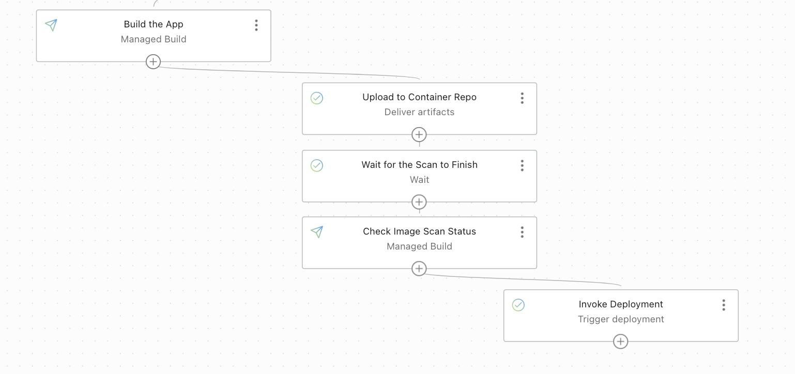

Objective

---

- Create an OCI devops build pipeline to build a container image for OKEdeployment.

- Use a OCI Vulnerability scanner and scan the image.

- If the image is valid proceed for deployment.

Procedure to use the illustration

-------

- Create OCI devops project / necessary policies - https://docs.oracle.com/en-us/iaas/Content/devops/using/home.htm .

- Set the policies for Build /Deploy / Connection policies.


- Create a OCI Build pipeline (with no stages for now)

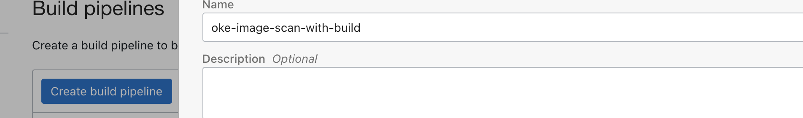

- Create an OCI Artifact repo (For container)

  - https://docs.oracle.com/en-us/iaas/Content/Registry/home.htm 


   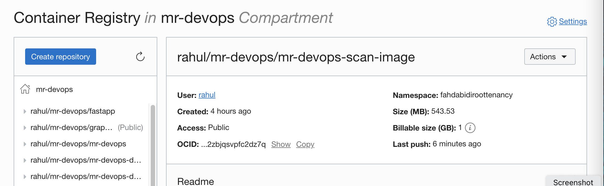

- Create a policy (identity) to enable vulnerable scanning for repo.

  - Refer below for policy statement.

```
allow service vulnerability-scanning-service to read repos in compartment  <COMPARTMENT Name>
allow service vulnerability-scanning-service to read compartments in compartment <COMPARTMENT Name>
```

- Create an Artifact with the container repo URL (POSTFIX with a BUILDHASH VARIABLE)


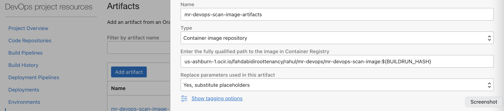

- Add a manage build stage to the build pipeline.

  - https://docs.oracle.com/en-us/iaas/Content/devops/using/managing_build_pipelines.htm 


  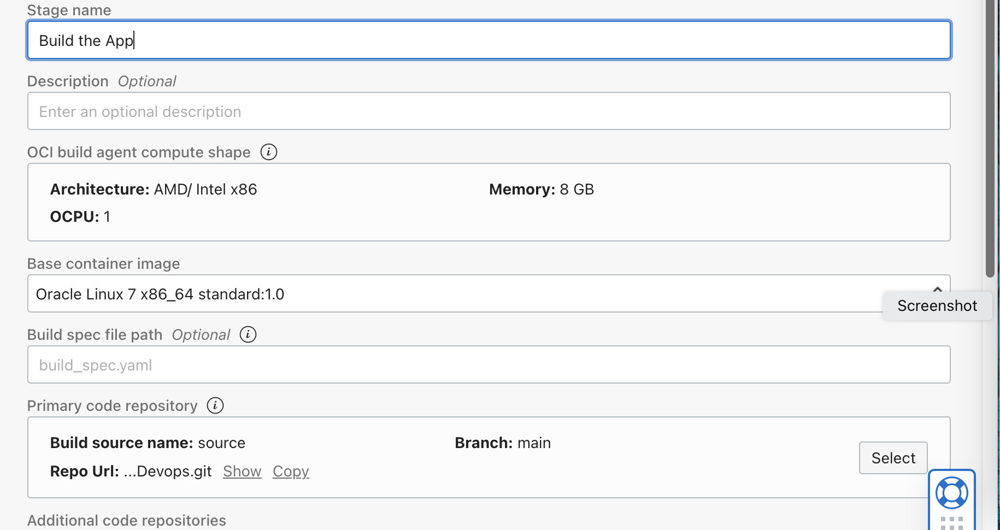

  - You may use GITHUB repo or OCI Code repo to hold the code base (clone this repo and use accordingly).

  - Add another upload artifact stage by using the artifact created.

  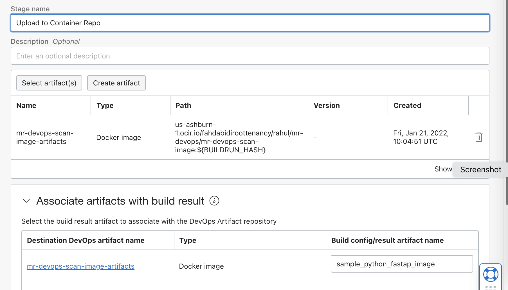

  - Add a scanner to the OCI Container repo that we had created.

  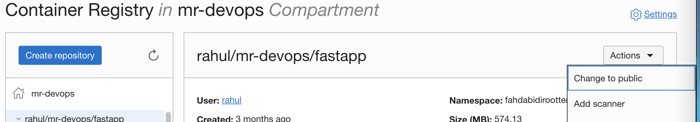

      - https://docs.oracle.com/en-us/iaas/scanning/using/scanning-images.htm#scanning_images 

  - The scan may take a while ,so add a wait stage to the build pipeline.

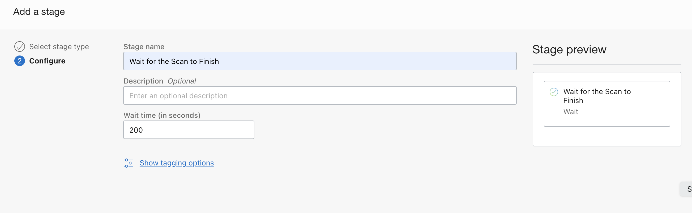 

- Add another manage build stage but with a custom yaml path as scan_check.yaml.

- You can use the same repo (Github or OCI code repo) but with the custom yaml file.


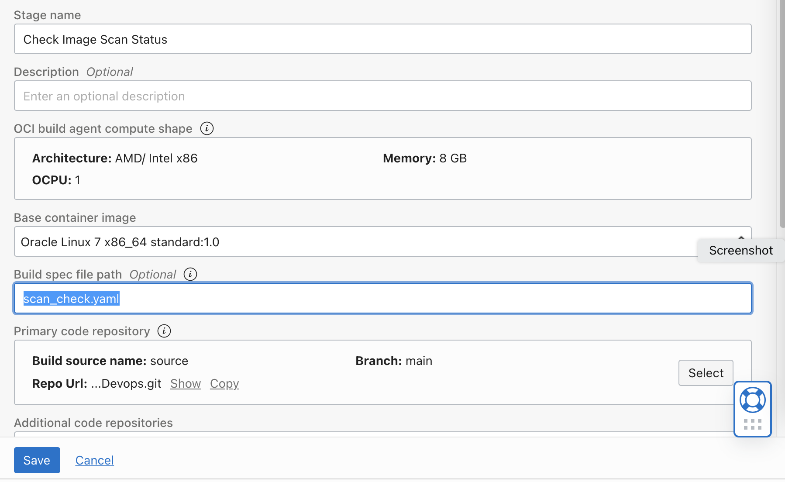

- Set below values as build params.

```
SCAN_CHECK_BASELINE - None

REPO_NAME - Container Repo name

COMPARTMENT_ID - Compartment OCID

```

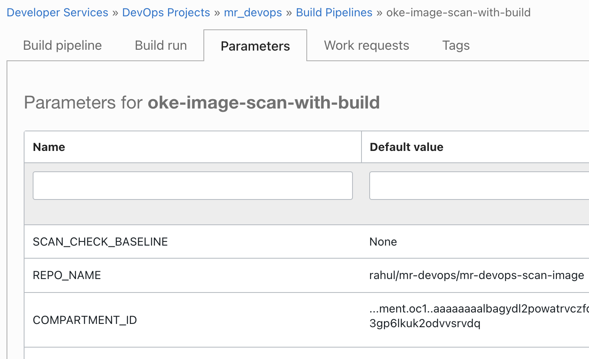


All set for test ....

-----

- If your docker images is safe it will follow the build pipeline and invoke the deployment .

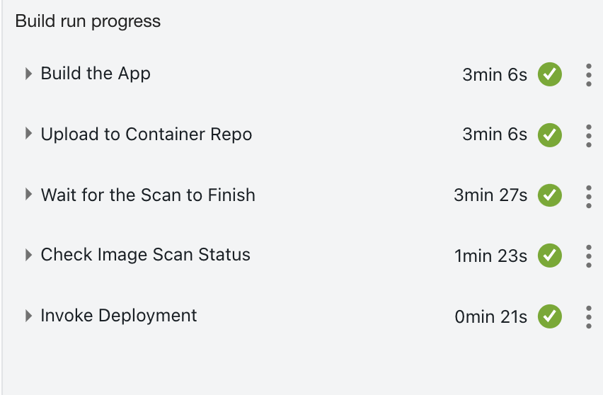


- If not it will fail and wont proceed for deployment.

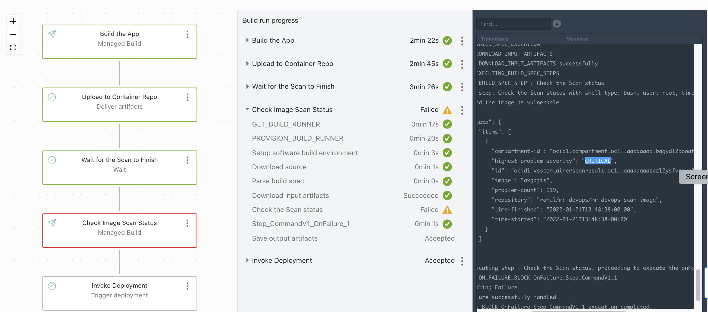

Tail end

-----

- To complete the flow ,create a deployment pipline ,you can use the reference spec file (deployment_spec mentioned here) - https://docs.oracle.com/en-us/iaas/Content/devops/using/deployment_pipelines.htm .You may declare the artifacts and build parameters as variables.

- You may add OCI CLI Steps to delete the image from repo if found invalid.


